# Getting Started

- [IDE Setup](#ide-setup)
- [Create Project](#create-project)
- [New Source File](#new-source-file)
- [Compiler Settings](#compiler-settings)
- [Pin Mapping](#pin-mapping)
- [UART Setup](#uart-setup)
- [Programming](#programming)
- [Design Constraints](#design-constraints)
- [Timing Errors](#timing-errors)
- [Project Files](#project-files)

--------------------------------------------------------------------------------

## IDE Setup

After installing the
[Lattice Diamond](https://www.latticesemi.com/en/Products/DesignSoftwareAndIP/FPGAandLDS/LatticeDiamond)
IDE, you'll need to
[generate a license](https://www.latticesemi.com/Support/Licensing/DiamondAndiCEcube2SoftwareLicensing/DiamondFree)
and set up the environment variable.

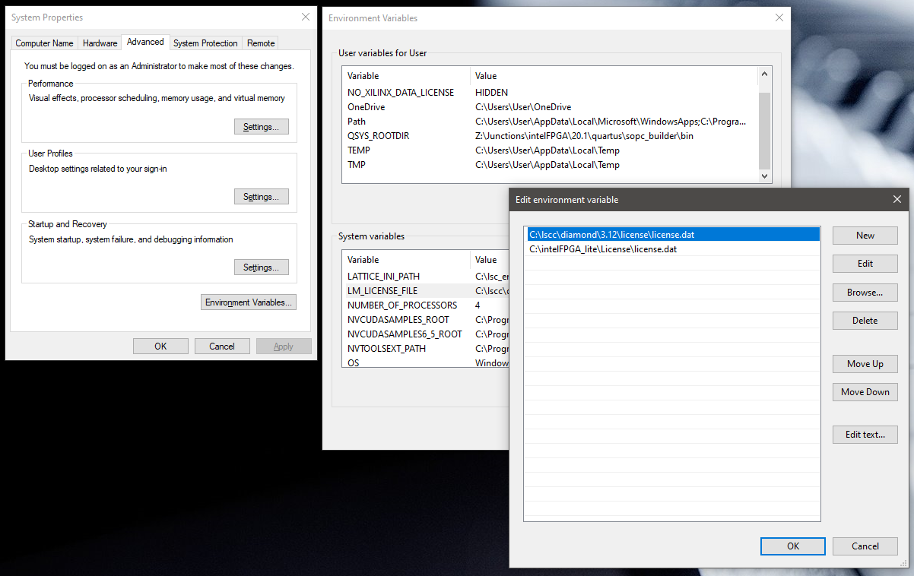

Once the license is set up, you can start Diamond from the Start menu.

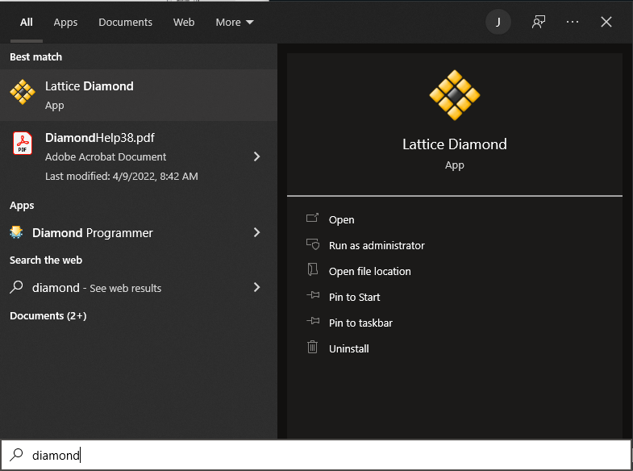

If you'd like to change the default text editor, go to `Tools`, `Options`.

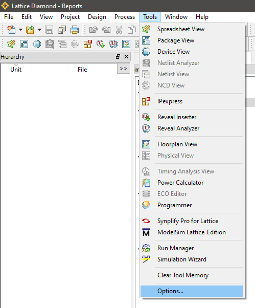

You can then add a program to various file types in the `File Associations` section.

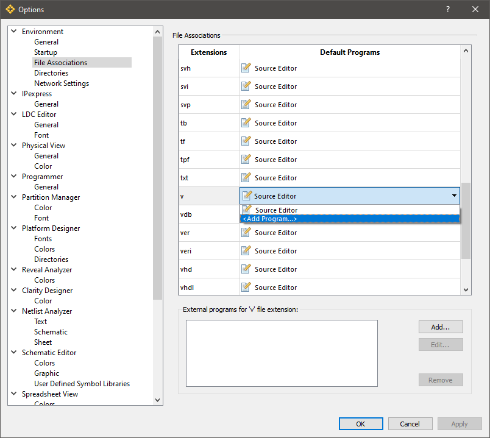

After setting up the program, copy the `External Program` to the clipboard.

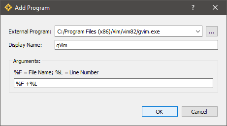

You can now paste that to all the other file extensions you want to change.

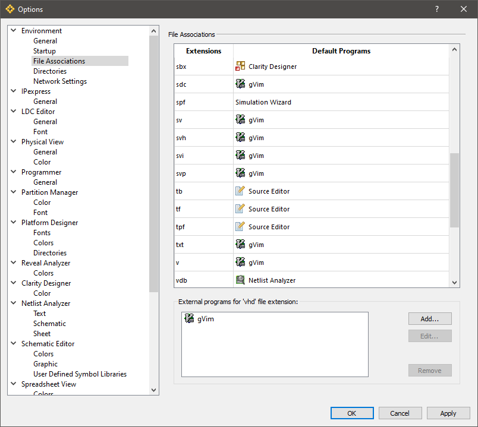

--------------------------------------------------------------------------------

## Create Project

From the `Start Page`, select `New...`.

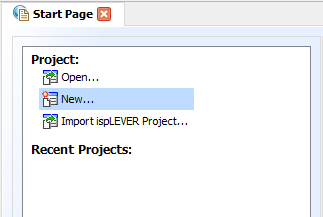

Then click `Next`.

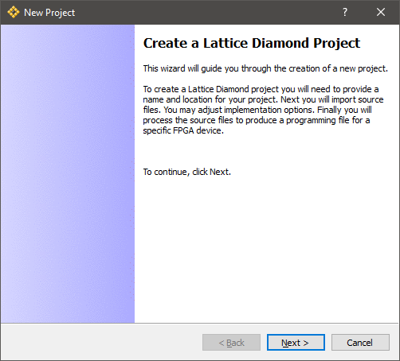

Choose a convenient place for your project and give it a name.

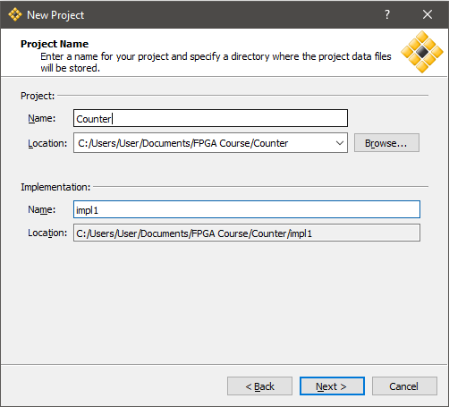

We don't want to add existing files at this point: there aren't any.


Read the device code from the top of the IC and select the correct part.

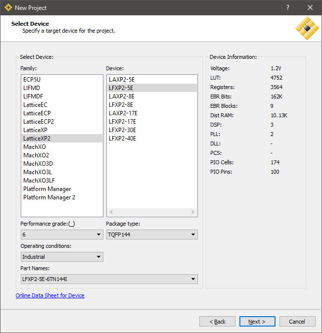

Choose `Synplify Pro` as the compiler.  `Lattice LSE` does not support SystemVerilog.

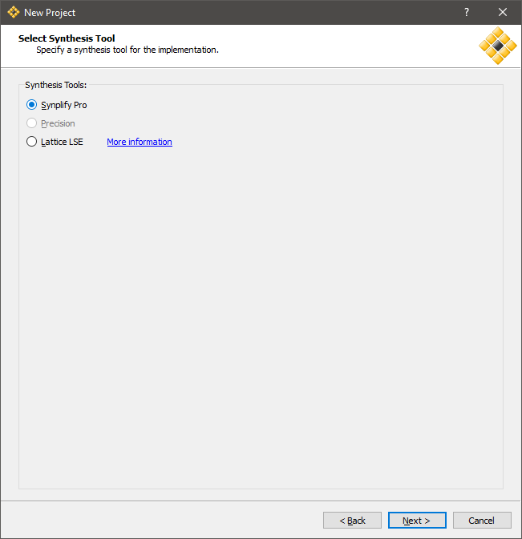

Review the project information and click `Finish`.

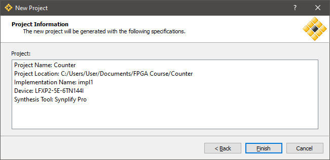

--------------------------------------------------------------------------------

## Project Files

A short-list of important files (i.e. files you might want to keep in Git) include:

Extention | Type                  | Description
--------- | ----                  | -----------
`.ldf`    | Lattice Diamond File  | The main project file
`.ini`    | Initialisation        | IDE-specific settings, like build chain selections
`.sty`    | Strategy              | Compiler settings
`.lpf`    | Logic Preference File | IO standards, pin assignments, etc.
`.fdc`    | Design Constraints    | Synopsis design constraints
`.rvl`    | Reveal                | Reveal inserter
`.rva`    | Reveal                | Reveal analyser
`.rvs`    | Reveal                | Reveal settings
`.v`      | Verilog               | Verilog or SystemVerilog source
`.sv`     | SystemVerilog         | SystemVerilog source
`.vhd`    | VHDL                  | VHDL source
`.xcf`    | Configuration File    | Programming project file
`.jed`    | JEDEC                 | Implementation binary

A more comprehensive list can be found in Table 1 of the 
[Lattice Diamond User Guide](https://www.latticesemi.com/view_document?document_id=53077)

A typical `.gitignore` might therefore look as follows:

```
.vs
.vscode
*.swp
*.bak
~*

*_tcr.dir
*.ccl
*.xml
*.tpf

*.svf
*.trc

impl1/*

!impl1/*.xcf
!impl1/*.jed
```

--------------------------------------------------------------------------------

## New Source File

Once the project has been created, create a new source file.

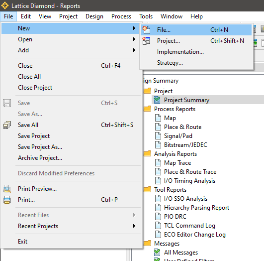

Create a conveniently-named Verilog file (or VHDL if you so prefer).


Implement a module that makes the LEDs flash.


--------------------------------------------------------------------------------

## Compiler Settings

There are a few compiler settings you want to change at this point.

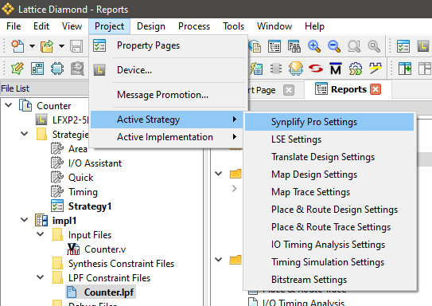

Set the VHDL version to 2008 (in case you want to implement modules in VHDL).

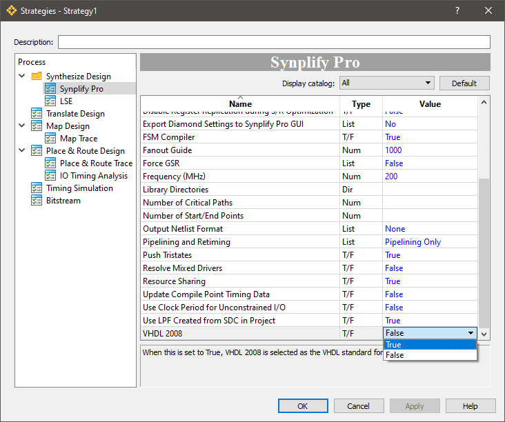

Also make sure that the `Map Trace` tool warns you against unconstrained paths.

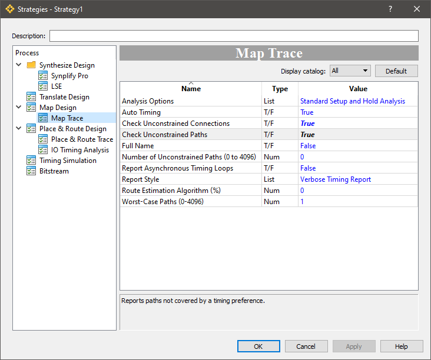

Then go to the `Property Pages`.

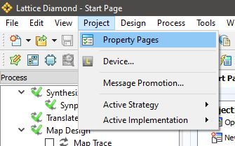

And set the Verilog version to `SystemVerilog`.

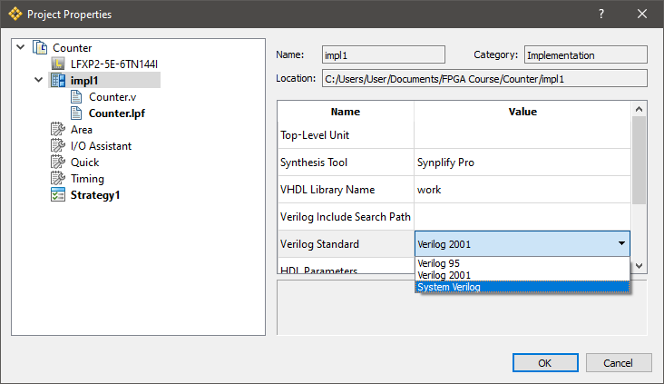

--------------------------------------------------------------------------------

## Pin Mapping

In order to be able to perform pin-mapping, you need to compile first.  You 
might need to select a different tab in order to see the `Process` window.

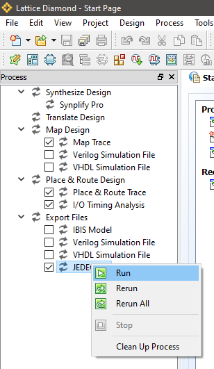

The compiler assigns random pins.  Do not program this onto your device, 
because you stand a good chance of damaging pins.  Open the `Spreadsheet View`.


Consult the
[development kit user guide](https://www.latticesemi.com/view_document?document_id=43735)
to get the pin numbers of the LEDs.


You can find the clock pin in the schematic section.

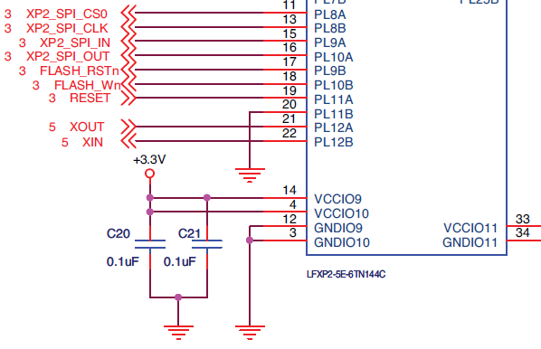

The net names make the direction confusing, so consult the clock circuit.

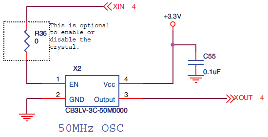

The Lattice FPGAs have weak pull-up resistors on all
[unsused pins](https://www.latticesemi.com/en/Support/AnswerDatabase/1/0/3/1033)
so you do not need to explicitly drive the `XIN` net to enable the clock.

In the `Spreadsheet View`, assign the pins.

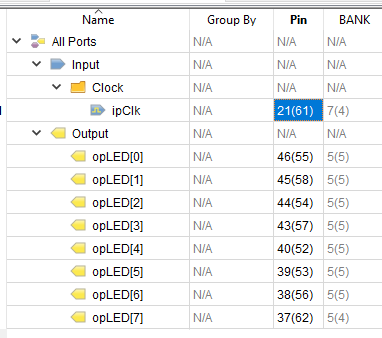

Consult the schematic section of the
[user guide](https://www.latticesemi.com/view_document?document_id=43735)
to see that all banks are set up as 3.3&nbsp;V&nbsp;CMOS.

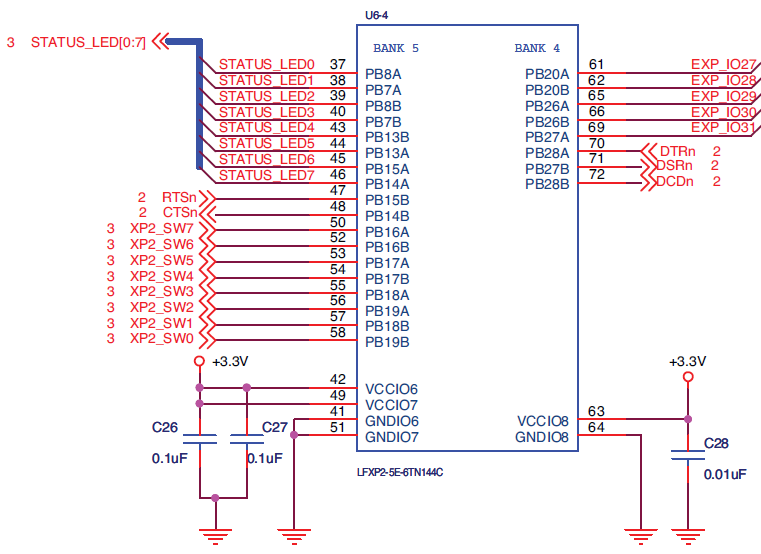

Before you can set the pin IO standards accordingly, you need to recompile the design.

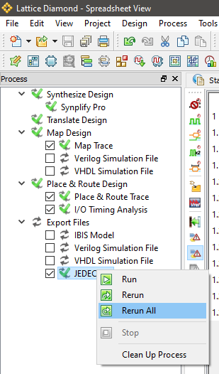

You can now use the right-click menu to set multiple pins at once.

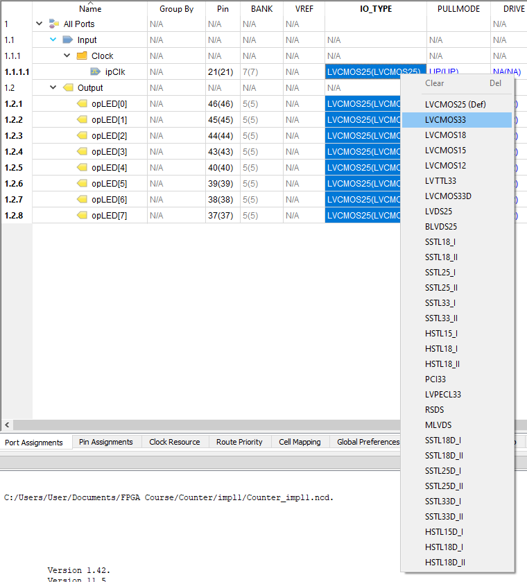

Open the `.lpf` in a text editor.

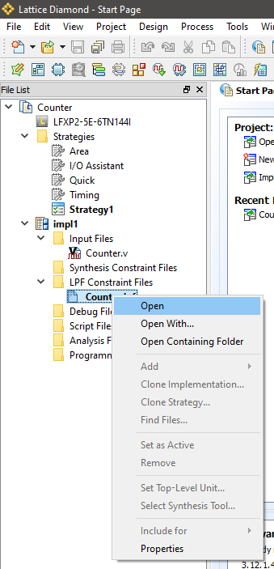

You'll see that all the allocations you've just done are simple text lines in 
the `.lpf` file.  You can edit this file directly, without using the GUI, 
which is very convenient when you are using Excel, Python or some other tool 
to auto-generate large numbers of pin assignments.

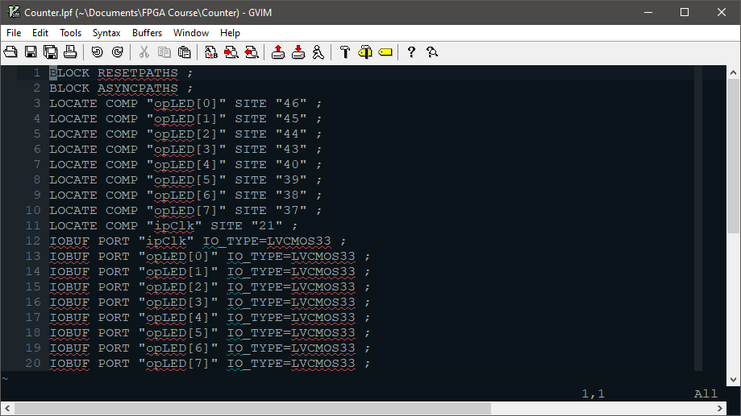

--------------------------------------------------------------------------------

## UART Setup

Consult the schematic section of the
[user guide](https://www.latticesemi.com/view_document?document_id=43735)
to see which bus of the FTDI IC drives the UART.  In this case, it is
port&nbsp;B.  Also note that port&nbsp;A is the JTAG.

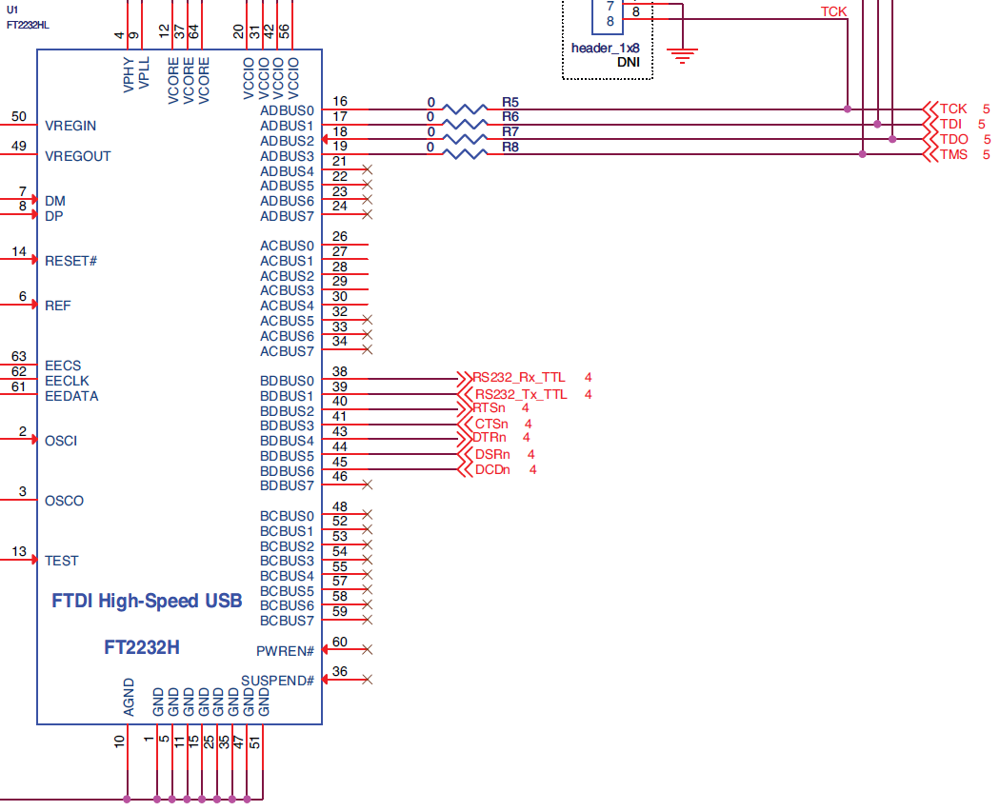

Plug the development board into your computer's USB and open `Device Manager`.

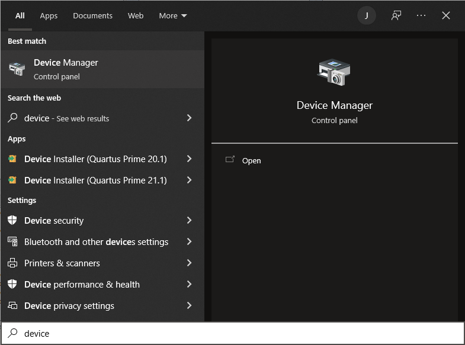

Edit the properties of port&nbsp;B of the `USB Serial Converter`.

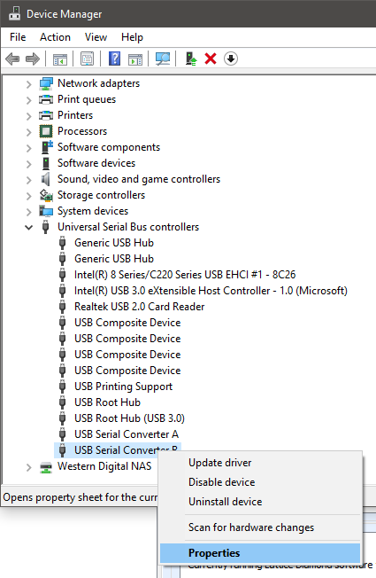

Enable the virtual COMM port.

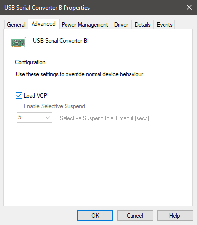

Plug the development board out and in again.  This will load
the COMM port.  Note the port number.

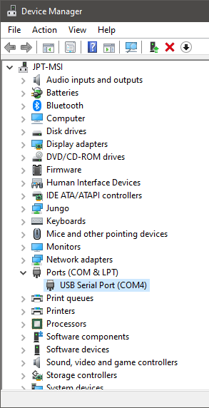

If you have board that has been pre-loaded with
[the example design](https://www.latticesemi.com/view_document?document_id=37224),
open PuTTY (or some other serial terminal of your choice).

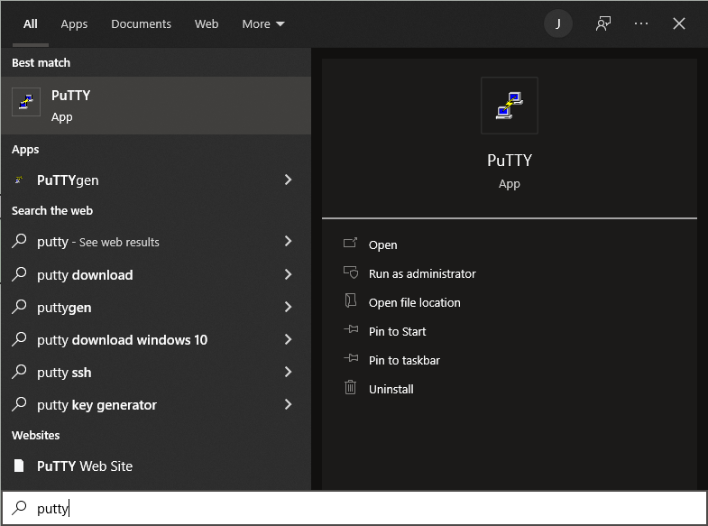

Set up the COMM port to use a Baud rate of 115200.

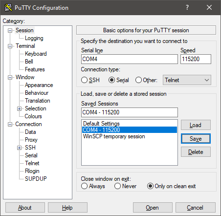

Open the port and press `0` on the keyboard to display the main menu of the 
development board default firmware.

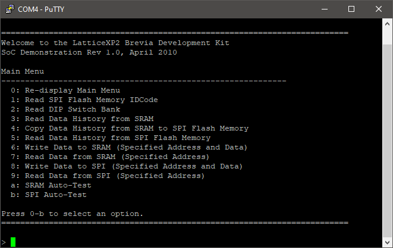

--------------------------------------------------------------------------------

## Programming

Open the `Programmer` tool.  Then click on the `Detect Cable` button.

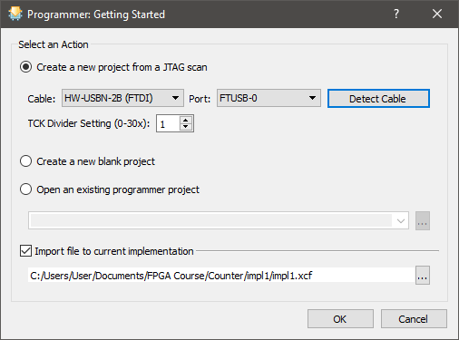

Select port A of the FTDI USB device.

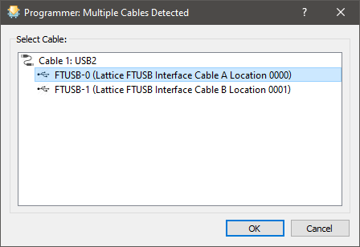

You should now have a programming project set up and ready to go.  Don't 
program the board yet, because the default setup programs the flash, which is 
non-volatile.

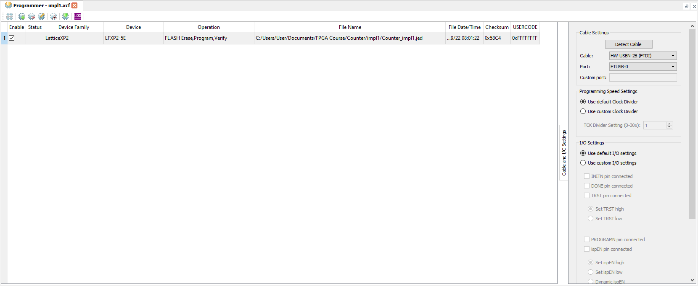

Instead, double-click on the line to open the settings.  Then set the
`Access mode` to `Static RAM Cell Mode`, which programs the FPGA in a volatile
fashion.  If you'd like to go back to the previous firmware after programming, 
power-cycle the board.

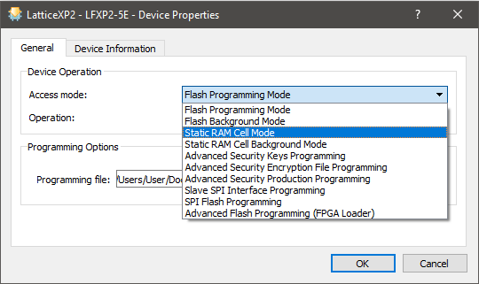

Click the `Program` button to program the board.


After the programming completes, your LEDs should be counting.

--------------------------------------------------------------------------------

## Design Constraints

Every design must have timing constraints, otherwise the compiler assumes 
whatever it feels like.  Create a new constraints file.

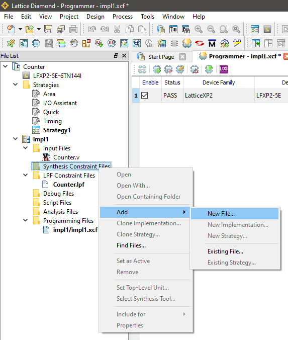

Call it a convenient name, using the `.fdc` file extension.


Add appropriate design constraints to set the clock frequency and paths that 
should be ignored.  The example below works for most simple projects.

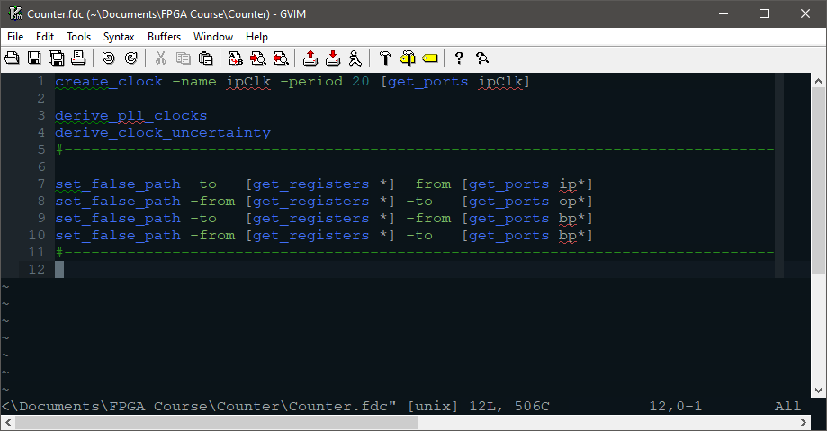

--------------------------------------------------------------------------------

## Timing Errors

If you modify the `.fdc` file to specify a much faster clock, the compiler 
will complain that it cannot meet timing requirements.

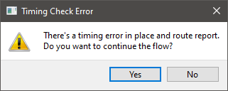

You can view the `Map Trace` report for details.

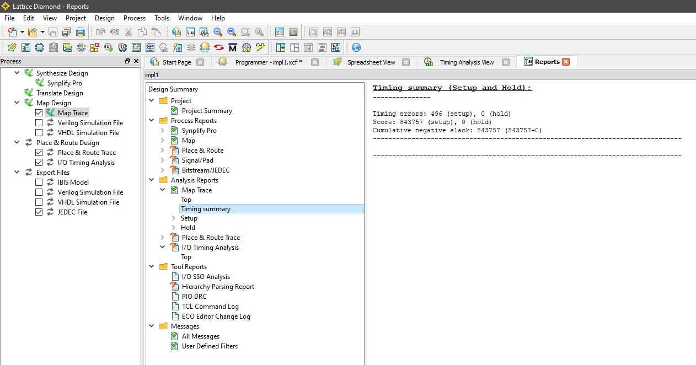

If you want more specific details, you can open the `Timing Analysis View`, 
which shows detailed information related to the failing path(s).

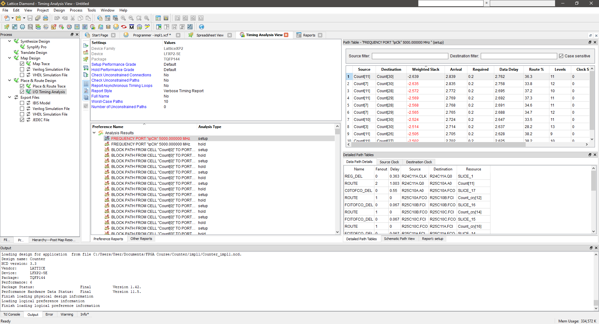

--------------------------------------------------------------------------------

