# Simulation

- [IDE Setup](#ide-setup)
- [Create Testbench](#create-testbench)
- [Compile](#compile)
- [Simulate](#simulate)
- [Wave Navigation](#wave-navigation)
- [Scripting](#scripting)
- [Breakpoints](#breakpoints)
- [Resets](#resets)

--------------------------------------------------------------------------------

## IDE Setup

Open the Mentor Modelsim Lattice Edition.

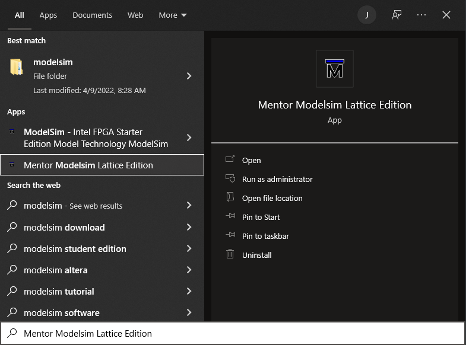

After starting Modelsim, first thing to do is change the working folder to 
your working folder.

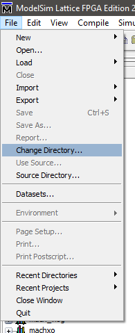

It is generally a good idea to have a dedicated `Simulation` folder, separate from where the source files are stored.

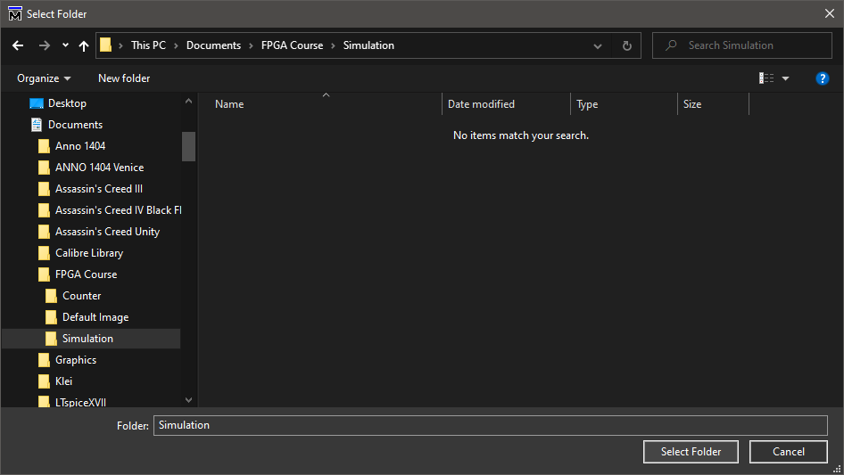

Open up the `Compile Options` dialogue.

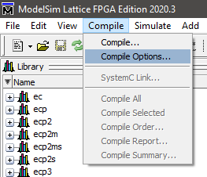

Set the VHDL version to 2008.

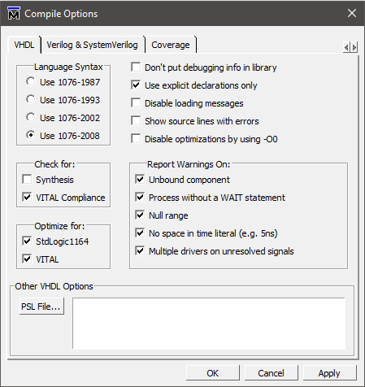

And the Verilog version to SystemVerilog.

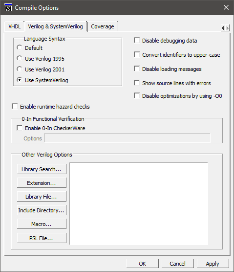

--------------------------------------------------------------------------------

## Create Testbench

Create a new Verilog source file, which will become the testbench for the 
`Counter` module.

Implement a testbench for the `Counter`.  The example below includes a reset 
signal, which will be used later.

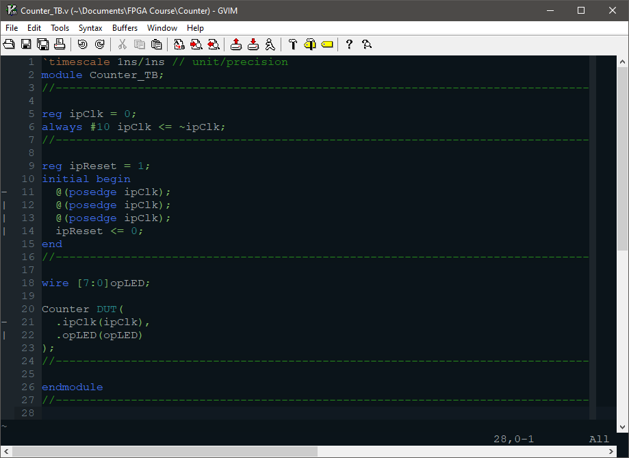

--------------------------------------------------------------------------------

## Compile

Compile the new modules.

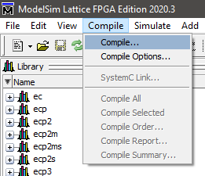

Choose the `Counter`, along with its testbench.

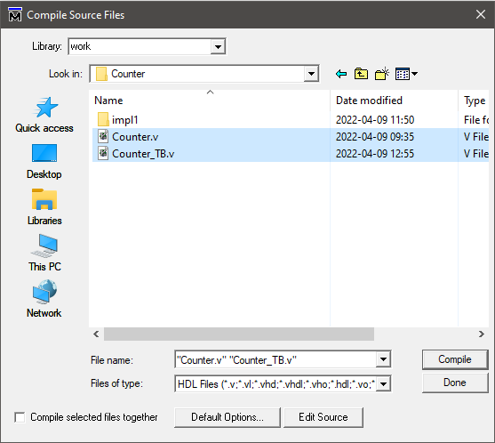

Let Modelsim create the `work` library for you.

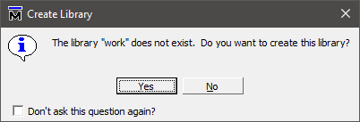

If all goes well, the transcript will show that the compile was
successful.  Follow the errors and fix the syntax errors otherwise.

--------------------------------------------------------------------------------

## Simulate

Simulate the test-bench.

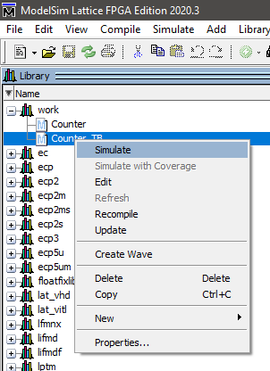

Drag the signals over to the wave-form viewer and set the radix to `Hexadecimal`.

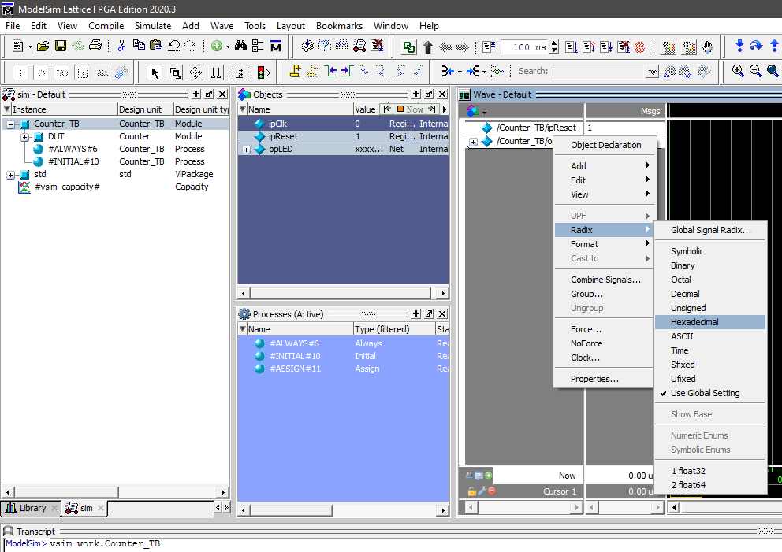

Run the simulation for 1 second.

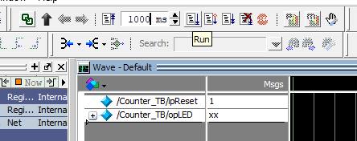

You'll notice a problem with the LEDs.  The result is `unknown` for the full 
duration of the simulation.

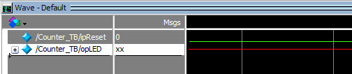

The problem is that the `Count` signal is not initialised, so add an initialiser.

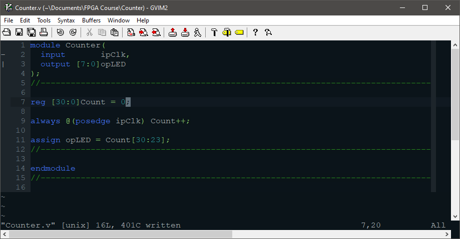

When you make changes to the source, it has to be recompiled.

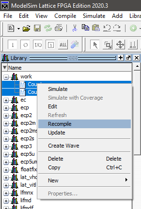

And the simulation must be restarted.

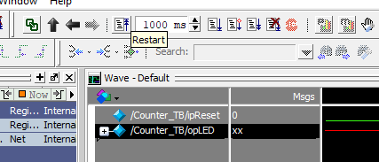

When prompted, restart everything.

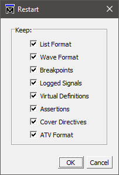

You can then run the simulation again.

--------------------------------------------------------------------------------

## Wave Navigation

To zoom in with the mouse, drag with the middle mouse button. Dragging in an 
upwards direction zooms out, whereas dragging in a downwards direction zooms in.

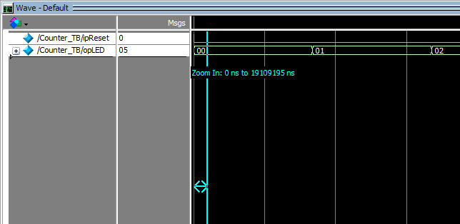

You can place a cursor by dragging with the left mouse button.  It generally 
snaps to nearby edges.

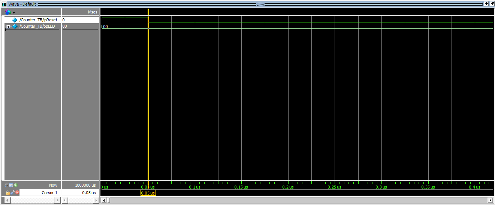

To measure time intervals, start by dragging the marker to the correct
place.  Then lock the existing marker and use the green `+` button to create 
another one. Drag it to the second point.

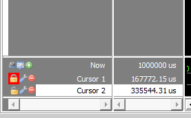

To set the time scale on the wave-form viewer, right-click on the time-scale and open up the `Grid, Timeline & Cursor Control` dialogue.

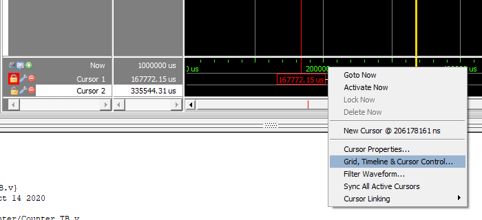

Set the time-scale to milliseconds.

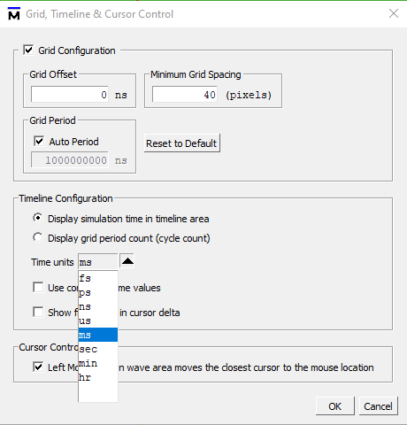

All times are now displayed in a convenient unit.

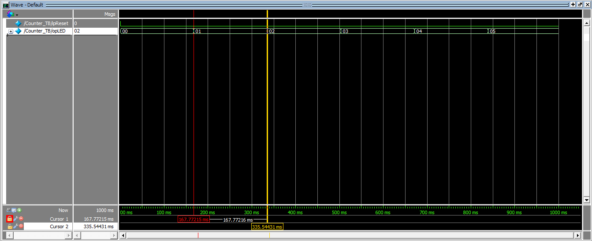

--------------------------------------------------------------------------------

## Scripting

Once everything is set up, you can create a script to set up
future sessions. Use the `Save Format` option.

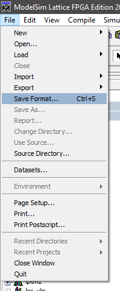

Pick an appropriate file name and location.

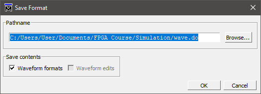

Edit the generated TCL script to do what you want it to do.  Typically, it should
switch to the work library, compile the source files (in the correct order),
open the simulation, set up the wave-forms and viewer properties and then run
the simulation.  The `Save Format` feature does only the wave-form setup.

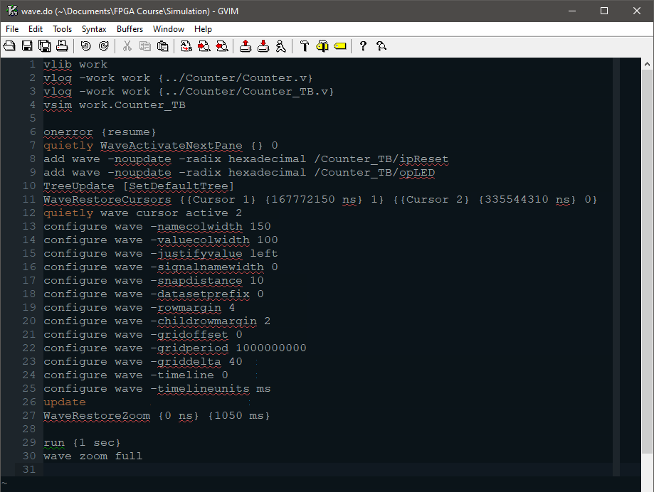

To test the script, close Modelsim completely and then re-open it. Switch 
working folder as before and then "source" the script using the TCL console.

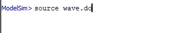

--------------------------------------------------------------------------------

## Breakpoints

It is often useful to debug using break-points.  Edit the file in Modelsim.

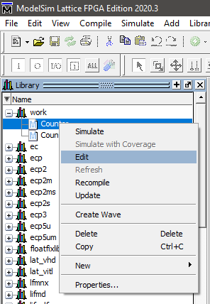

Then click the margin to set breakpoints.

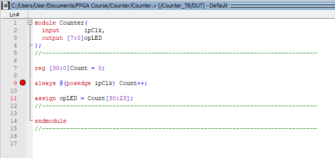

When you run the simulation, the process will break at the set point, and you 
can use mouse-hover to obtain the values of variables and signals.

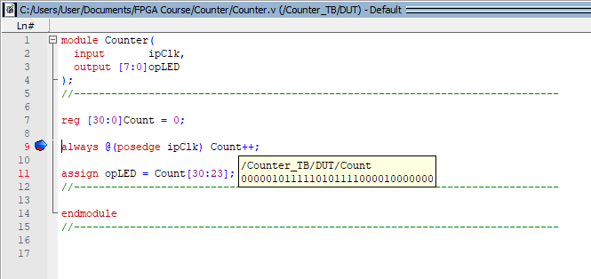

--------------------------------------------------------------------------------

## Resets

Not all FPGAs can initialise registers during initialisation.  It is therefore 
much better to use a dedicated reset signal.  Edit the `Counter` module and 
add a reset.  Remember to hook up the new reset signal in the testbench.

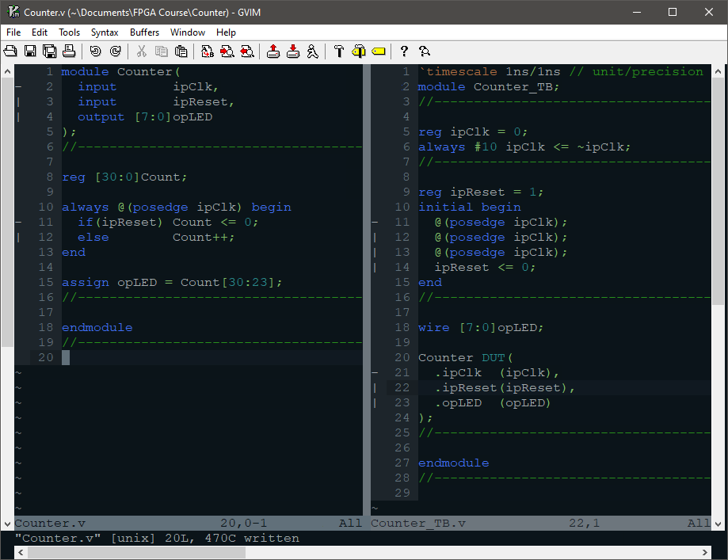

You can now resimulate the design to see that the reset is working correctly.

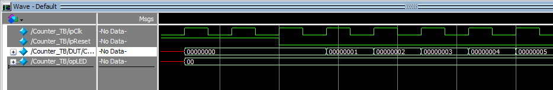

Remember to add the new `ipReset` pin to the `.lpf` file before you load it
onto the FPGA.

--------------------------------------------------------------------------------

