# JTAG Debugging

- [Inserter](#inserter)
- [Analyser](#analyser)

--------------------------------------------------------------------------------

## Inserter

With the latest project open, open the `Reveal Inserter` tool.

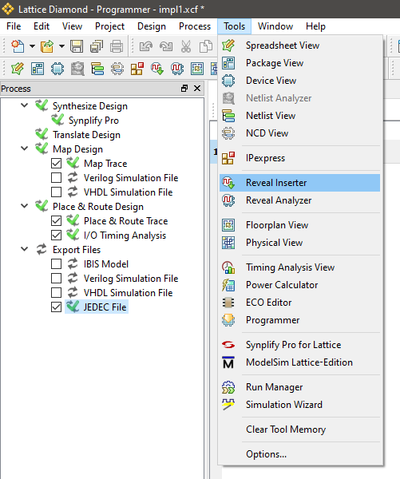

Drag and drop the signals you want to inspect.  Also set up the
`Sample Clock`, `Buffer Depth`, `Sample Enable`, etc.

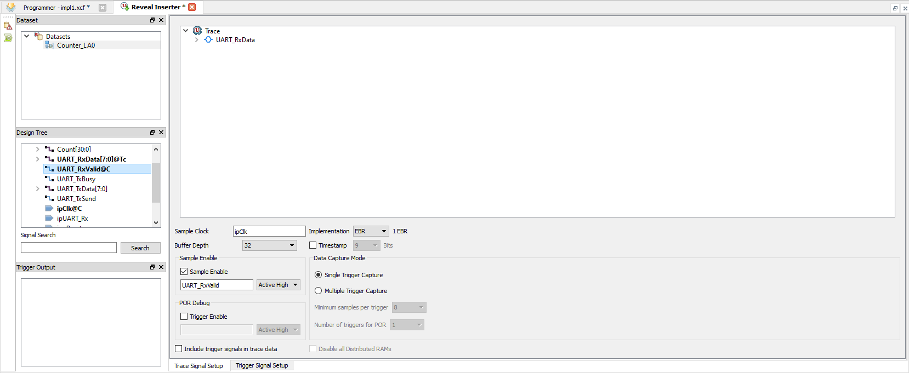

Switch to the `Trigger Setup Setup` tab and set up the trigger.

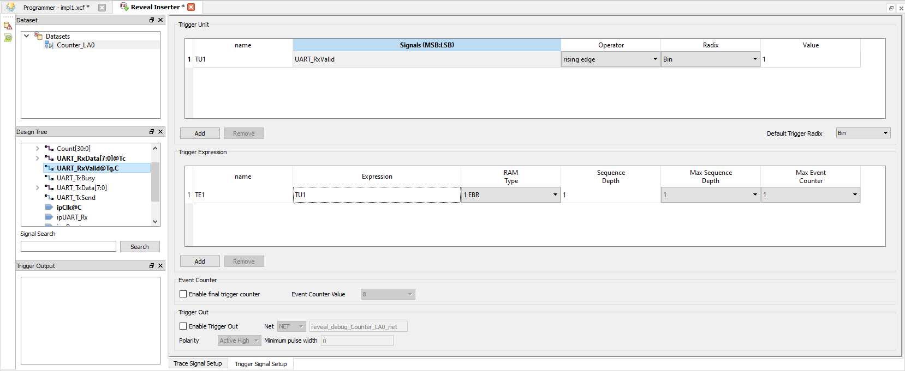

Click the `Insert Debug` button.

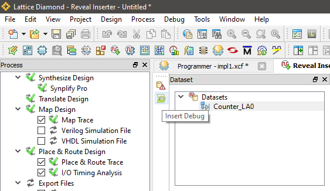

Click `Ok` to add the logic analyser core to the design.

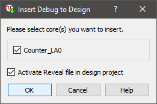

Choose a convenient file name.

--------------------------------------------------------------------------------

## Analyser

After the analyser core has been inserted into the design, recompile.

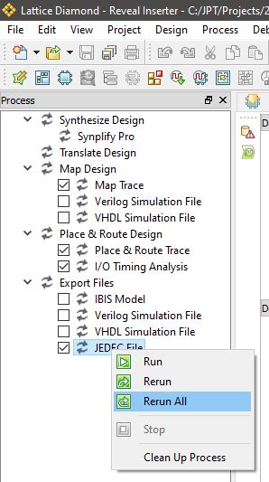

Then program the FPGA.

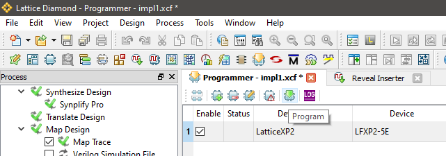

After programming is complete, open the `Reveal Analyzer` tool.

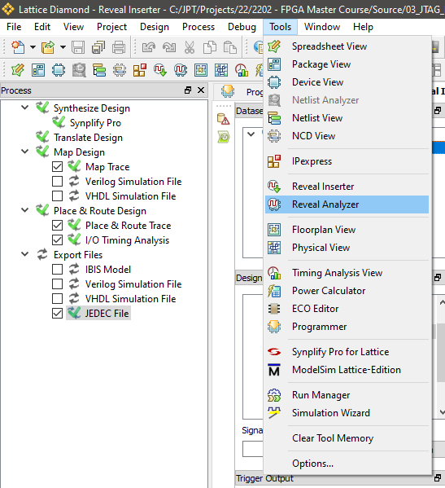

Choose a convenient file name, set the USB device correctly, auto-detect the 
USB port, select the `.xcf` used to program the FPGA, `Scan` for the
`Debug device` and add the `.rvl` file created by the `Reveal Inserter` tool.

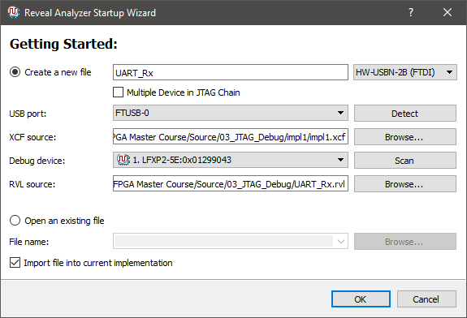

Switch to the `LA Waveform` tab and click `Run`.

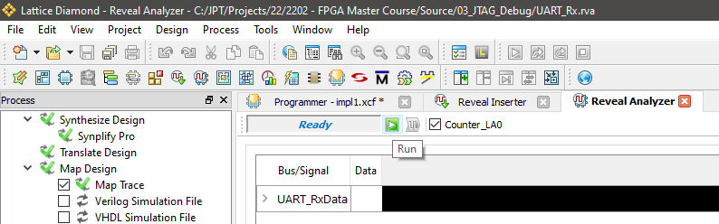

If you followed this example, you now need to use the serial terminal to send 
a bunch of characters to the UART.  After 32 characters has been captured, the 
analyser will display the result.

You can now set the `Bus Radix` to something more readable.

Make it `Hex`.

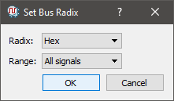

The characters received by the UART module will now be displayed.

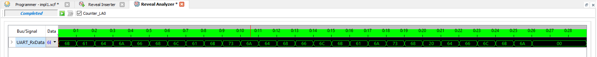

--------------------------------------------------------------------------------

