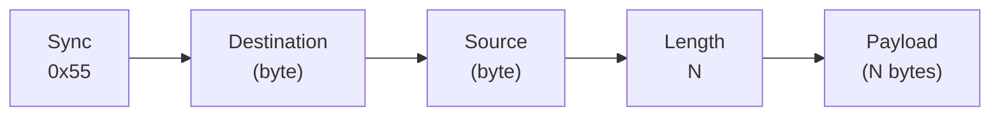
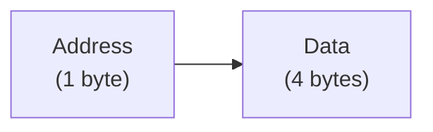

# Memory-Mapped Register Control Interface

- [The Registers Module](#the-registers-module)
- [UART Packets](#uart-packets)
- [Control Messages](#control-messages)
- [Data Messages](#data-messages)

For this practical, implement some control registers
and control them over the UART.

## The Registers Module

It is very useful to pass registers around in structures, so create a package 
for that purpose:

```SystemVerilog
package Structures;
//------------------------------------------------------------------------------

typedef struct{
  logic [31:0]ClockTicks;
  logic [ 3:0]Buttons;
} RD_REGISTERS;

typedef struct{
  logic [7:0]LEDs;
} WR_REGISTERS;
//------------------------------------------------------------------------------

endpackage
//------------------------------------------------------------------------------
```

**Note:** For the structures to work properly you have to get Lattice Diamond 
to compile the `Structures` package before any module that uses those 
structures.  To do this, move the `Structures.v` file to the top of the list,
which you can do by dragging the file in the `File List` tool
in the `.ldf` file.

Create a new `Registers` module that implements the registers, as shown below.

```SystemVerilog
/*------------------------------------------------------------------------------

Defines the registers, and implements a memory-mapped register interface.
------------------------------------------------------------------------------*/

import Structures::*;
//------------------------------------------------------------------------------

module Registers(
  input               ipClk,
  input               ipReset,

  input  RD_REGISTERS ipRdRegisters,
  output WR_REGISTERS opWrRegisters,

  input         [ 7:0]ipAddress,
  input         [31:0]ipWrData,
  input               ipWrEnable,
  output reg    [31:0]opRdData
);
//------------------------------------------------------------------------------

reg Reset;

always @(posedge ipClk) begin
  case(ipAddress)
    8'h00  : opRdData <= ipRdRegisters.ClockTicks;
    8'h01  : opRdData <= ipRdRegisters.Buttons;
    8'h02  : opRdData <= opWrRegisters.LEDs;
    default: opRdData <= 32'hX;
  endcase
  //----------------------------------------------------------------------------

  Reset <= ipReset;

  if(Reset) begin
    opWrRegisters.LEDs <= 0;
  //----------------------------------------------------------------------------

  end else if(ipWrEnable) begin
    case(ipAddress)
      8'h02: opWrRegisters.LEDs <= ipWrData;
      default:;
    endcase
  end
end
//------------------------------------------------------------------------------

endmodule
//------------------------------------------------------------------------------
```

## UART Packets

Messages over the UART should be packetised, as shown below.



Implement a module that abstracts the interface by taking the raw byte stream
from the UART and output the payload as packetised streams, and vice versa.

The destination, source and length fields should be metadata running alongside
the data.  It is your choice whether or not you want to support zero-length 
packets.  Add the following structure to your `Structures` package:

```SystemVerilog
typedef struct{
  logic [7:0]Source;
  logic [7:0]Destination;
  logic [7:0]Length;

  logic      SoP;
  logic      EoP;
  logic [7:0]Data;
  logic      Valid;
} UART_PACKET;
```

If you like, you can add a checksum feature.  The checksum should be the last 
thing sent, and packets with an invalid checksum should not generate a 
packet.  Be aware that this involves implementation of a buffer in order to 
keep packets back until the checksum can be verified.

Incorporate the UART module itself as a submodule of the packetiser.  You can
use the black box definition below:

```SystemVerilog
import Structures::*;
//------------------------------------------------------------------------------

module UART_Packets(
  input              ipClk,
  input              ipReset,

  input  UART_PACKET ipTxStream,
  output             opTxReady,
  output             opTx,

  input              ipRx,
  output UART_PACKET opRxStream
);
//------------------------------------------------------------------------------

// TODO: Instantiate the UART module here

//------------------------------------------------------------------------------

// TODO: Implement the Tx stream

//------------------------------------------------------------------------------

// TODO: Implement the Rx stream

//------------------------------------------------------------------------------

endmodule
//------------------------------------------------------------------------------
```

## Control Messages

Control can be implemented in a variety of ways.  For this practical, define 
the "read register" and "write register" as different destination ports.  You 
could, for example, use port `0x00` for "read" and `0x01` for "write".

The "write" can be fire-and-forget, and the "read" should return a result to 
the sender.

For the message format, you could use a 5-byte packet payload, as shown
below.  It is your choice whether or not you'd like to mirror the address
in the return packet.



Implement a module that receives register control messages and show that you
can use Python (or similar) to read the buttons and set the LEDs.  Something
like the script below should work:

```Python
import serial
import struct
import time
import sys
#-------------------------------------------------------------------------------

ClockTicks = 0x00
Buttons    = 0x01
LEDs       = 0x02
#-------------------------------------------------------------------------------

def Write(s, Address, Data):
    s.write(struct.pack('<BBBBBI', 0x55, 0x01, 0xAA, 0x05, Address, Data))
#-------------------------------------------------------------------------------

def Read(s, Address):
    s.write(struct.pack('<BBBBB', 0x55, 0x00, 0xAA, 0x01, Address))
    return struct.unpack_from('<I', s.read(9), offset=5)[0]
#-------------------------------------------------------------------------------

with serial.Serial(port='COM4', baudrate=115200) as s:
    for n in range(500):
        print(Read(s, Buttons))
        Time = Read(s, ClockTicks)
        Write(s, LEDs, Time >> 23)

        print(Time)
        sys.stdout.flush()
        time.sleep(0.02)
#-------------------------------------------------------------------------------
```

