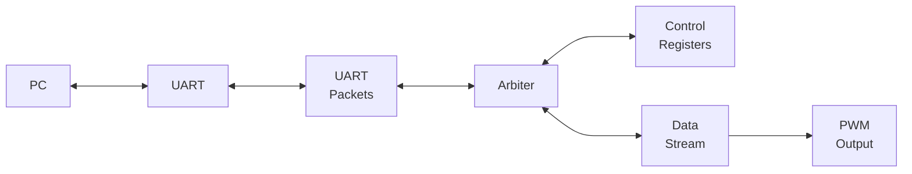

# Arbitration

- [The Arbiter](#the-arbiter)
- [Stream Upgrade](#stream-upgrade)

## The Arbiter

Include an arbiter so that the data streamer can send flow control packets 
directly to the PC.  Data from the PC to the endpoint can bypass the arbiter, 
as before, but packets from the endpoint to the PC must be arbitrated in such 
a way that the endpoints do not know that there are other endpoints on the bus.

Be careful with the exact details related to which module is allowed to wait 
for which, because it is relatively easy to cause a deadlock situation.  For 
more information related to exact handshaking details, you can consult:

- [Avalon Manual](https://www.intel.com/content/dam/www/programmable/us/en/pdfs/literature/manual/mnl_avalon_spec.pdf)
- [AXI Specification](http://www.gstitt.ece.ufl.edu/courses/fall15/eel4720_5721/labs/refs/AXI4_specification.pdf)
- [Wishbone B4](https://cdn.opencores.org/downloads/wbspec_b4.pdf)

In short:

- An Avalon source is allowed to wait for the sink to be ready before asserting the `Valid`.
- An AXI sink is allowed to wait for the source to be valid before asserting its `Ready`.
- A Wishbone slave must wait for valid data from the master before asserting its `Ack`.

## Stream Upgrade

Upgrade the streaming mechanism so that the PC does not need to poll the FPGA 
registers for the FIFO size.

The PC side becomes a little more tricky, because only one process can open
a UART at a time.  The exact implementation is up to you, but some or other
event-driven or async architecture generally works best for this.

