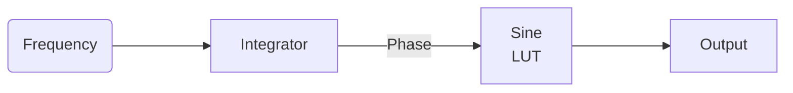

# NCO and DDC

- [Numerically Controlled Oscillator](#numerically-controlled-oscillator)
- [Digital Down Conversion](#digital-down-conversion)

## Numerically Controlled Oscillator

Implement a complex NCO (50 MSps, 10-bit phase, 18-bit amplitude) and verify 
through simulation.  The general architecture is given below.

Every clock cycle, the integrator adds its input to its output.  The sine 
lookup table can be implemented as a block of memory.

Also add the frequency word to the register bank.

## Digital Down Conversion

Implement a complex mixer (real input, complex NCO and complex output) and 
verify through simulation.  The next practical will add a low-pass filter so 
that the mixing image can be rejected.

